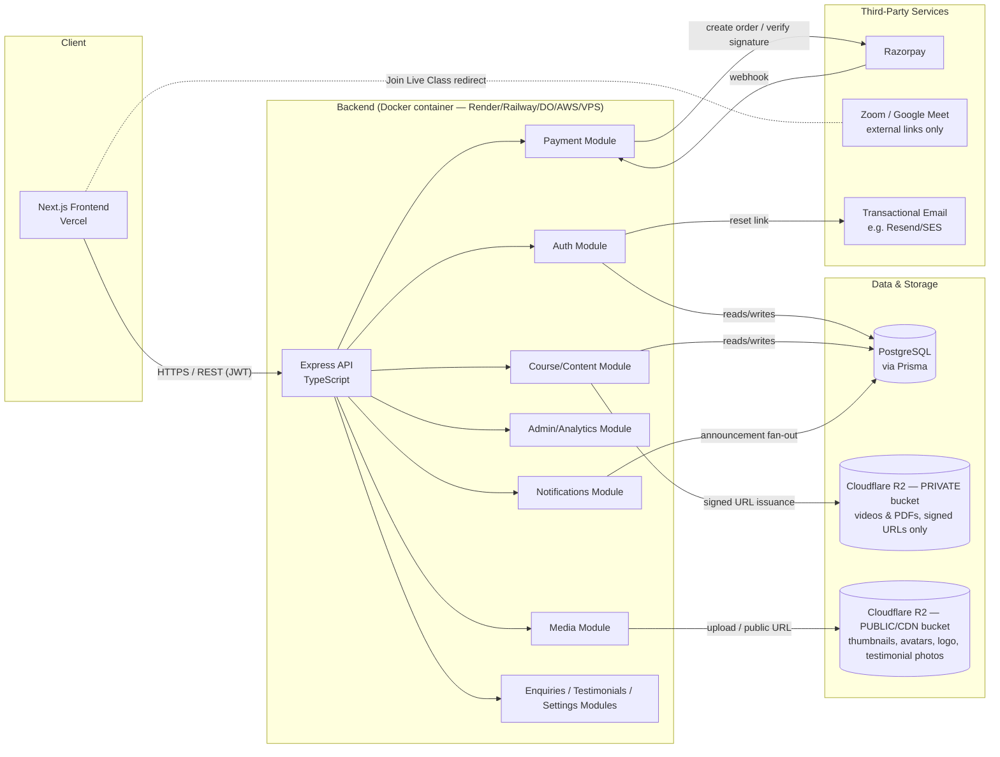
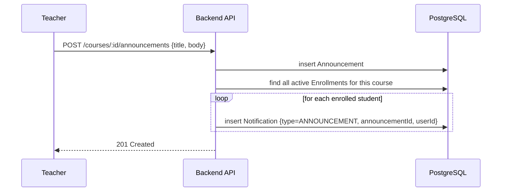

# System Architecture
## OASIS V1 — Module 1 Deliverable (v1.1 — post-refinement)

---

## 1. High-Level Architecture



**Why this shape (unchanged from the original Module 1):** a single
Dockerized modular monolith, not microservices — right-sized for ~100 to a
few thousand students, with internal module boundaries that make a future
service split a refactor, not a rewrite. What's new in this revision is
explicit: **three new backend modules** (Media, Notifications, and a small
cluster covering Enquiries/Testimonials/Settings) and a **second, public R2
bucket** dedicated to images, separate from the private video/notes bucket.
See §8 for why images get their own storage lane.

---

## 2. Backend Internal Layering (Clean Architecture)

*(Unchanged.)*

```
HTTP Request
   │
   ▼
Route (defines path + method, wires middleware)
   │
   ▼
Middleware (auth/JWT verify → RBAC check → validation)
   │
   ▼
Controller (thin: parse request → call service → shape response)
   │
   ▼
Service (business logic: "verify payment then unlock course")
   │
   ▼
Repository / Prisma Client (data access only, no business logic)
   │
   ▼
PostgreSQL
```

---

## 3. Folder Structure

```
oasis-platform/
├── frontend/
│   ├── src/
│   │   ├── app/                      # Next.js App Router
│   │   │   ├── (public)/             # Home, About, Courses, FAQs, Contact, etc.
│   │   │   ├── (auth)/               # Login, Register, Forgot Password
│   │   │   ├── (student)/dashboard/  # Student dashboard, my courses, player
│   │   │   ├── (teacher)/dashboard/  # Teacher content management UI
│   │   │   └── (admin)/dashboard/    # Admin/Super Admin console
│   │   ├── components/               # Reusable UI (buttons, cards, layout)
│   │   ├── lib/                      # API client, auth helpers, utils
│   │   ├── hooks/
│   │   ├── types/                    # Shared TS types (mirrors API contracts)
│   │   └── styles/
│   ├── public/
│   ├── next.config.ts
│   └── package.json
│
├── backend/
│   ├── src/
│   │   ├── modules/
│   │   │   ├── auth/                 # controller, service, routes, validators
│   │   │   ├── users/
│   │   │   ├── boards/               # Board, ClassGrade, Subject CRUD (catalog)
│   │   │   ├── courses/
│   │   │   ├── content/              # chapters, modules, lectures, notes
│   │   │   ├── quizzes/
│   │   │   ├── enrollments/
│   │   │   ├── payments/
│   │   │   ├── announcements/
│   │   │   ├── notifications/        # NEW — fan-out + read/unread state
│   │   │   ├── liveClasses/
│   │   │   ├── media/                # NEW — image upload, public URL issuance
│   │   │   ├── testimonials/         # NEW — Admin-managed
│   │   │   ├── enquiries/            # NEW — Contact Us intake + Admin triage
│   │   │   ├── settings/             # NEW — AcademySettings singleton
│   │   │   └── admin/
│   │   ├── middleware/                # auth, rbac, rateLimit, errorHandler, validate, requestId
│   │   ├── config/                    # env loading & validation, constants
│   │   ├── lib/                       # prisma client, r2Private client, r2Public client, razorpay client, logger
│   │   ├── docs/                      # swagger/openapi setup
│   │   └── app.ts / server.ts
│   ├── tests/
│   │   ├── unit/
│   │   └── integration/
│   └── package.json
│
├── database/
│   ├── schema.prisma
│   ├── migrations/                    # generated by Prisma from Module 2 onward
│   └── seed.ts
│
├── docker/
│   ├── docker-compose.yml
│   ├── backend.Dockerfile
│   └── frontend.Dockerfile
│
├── docs/                              # this folder
├── scripts/                           # ops scripts (backup, seed-prod-safe, etc.)
└── README.md
```

`lib/` now has two distinct storage clients (`r2Private`, `r2Public`) rather
than one — a deliberate reminder at the code level that these are different
buckets with different access rules, not just a naming convention.

---

## 4. Content Hierarchy & URL Structure

The catalog hierarchy is **Board → Class → Subject → Chapter → Module**,
with `Course` as the sellable unit at the Board+Class+Subject intersection
(full schema rationale in `docs/03-database-design.md §2.1`). This maps to
a predictable, SEO-friendly URL scheme:

| Purpose | Example URL | Backed by |
|---|---|---|
| Browse/filter courses | `/courses?board=cbse&class=8&subject=mathematics` | `Board.slug`, `ClassGrade.slug`, `Subject.slug` as filters |
| Course detail | `/courses/cbse-class-8-mathematics-foundation` | `Course.slug` (globally unique) |
| Chapter deep link | `/courses/cbse-class-8-mathematics-foundation/algebra-basics` | `Chapter.slug` (unique per course) |

Board/Class/Subject are shared, global reference data (not duplicated per
board) — see the trade-off discussion in `docs/03-database-design.md §2.1`
for why.

---

## 5. Role-Based Access Control (RBAC)

| Resource / Action | Super Admin | Admin | Teacher | Student |
|---|:---:|:---:|:---:|:---:|
| Manage Admin accounts | ✅ | ❌ | ❌ | ❌ |
| Manage Teacher/Student accounts | ✅ | ✅ | ❌ | ❌ |
| Create/edit own courses | ❌* | ❌* | ✅ | ❌ |
| Unpublish any course | ✅ | ✅ | own only | ❌ |
| View all payments | ✅ | ✅ | ❌ | own only |
| Purchase a course | ❌ | ❌ | ❌ | ✅ |
| Post announcement | ✅ (any) | ✅ (any) | ✅ (own course) | ❌ |
| Schedule live class | ❌ | ❌ | ✅ (own course) | ❌ |
| View admin dashboard | ✅ | ✅ | ❌ | ❌ |
| Upload course thumbnail / own avatar | ✅ (own) | ✅ (own) | ✅ (own course/avatar) | ✅ (own avatar) |
| Manage Testimonials | ✅ | ✅ | ❌ | ❌ |
| View / respond to Enquiries | ✅ | ✅ | ❌ | ❌ |
| Submit an Enquiry (Contact Us) | Public — unauthenticated | | | |
| Manage Academy Settings | ✅ | ✅ | ❌ | ❌ |
| View own Notifications | ✅ | ✅ | ✅ | ✅ |

\* Admins don't author courses in V1 — that's a Teacher responsibility — but
Admin/Super Admin can moderate (unpublish) any course.

`AcademySettings` is intentionally editable by Admin+ (not Super Admin
only) since it holds only public branding/contact info, never secrets — see
`docs/03-database-design.md §2.9`.

---

## 6. Key User Flows

*(The Registration & Login, Course Purchase & Unlock, Video Streaming, and
Live Class Join flows are unchanged from the original Module 1 and are not
repeated here in full — see the flow diagrams already approved. One flow is
new in this revision:)*

### 6.1 Announcement → Notification Fan-out (new)



The fan-out happens synchronously in V1 given the expected scale (~100
students per course, worst case). If course sizes grow into the thousands,
this becomes a queued background job without changing the API contract —
noted here so it isn't a surprise later, not because it's needed now.

### 6.2 Device Limit Enforcement — Trade-off

*(Unchanged — see the original decision: Strategy A, reject the 3rd login,
with a one-click "log out other device" escape hatch.)*

---

## 7. API Versioning & Consumption

*(Unchanged.)* All endpoints are under `/api/v1/...`.

---

## 8. Media Strategy

Images (course thumbnails, teacher avatars, the academy logo, testimonial
photos) are handled differently from videos and notes, because they have
fundamentally different access requirements:

- **Videos & PDFs** stay exactly as originally designed: private R2 bucket,
  never a public URL, access only via short-lived signed URLs issued to
  enrolled students.
- **Images** go in a **second, public/CDN-fronted R2 bucket** (or Cloudflare
  Images, if its transform/resize features are wanted later). A course
  thumbnail has to render in a public course-listing page a search engine
  can crawl; a teacher's avatar has to load instantly on a public teacher
  profile page; the academy logo has to appear in Open Graph previews when
  someone shares a link on WhatsApp. None of that works behind a short-lived
  signed URL, and none of it needs to be — there's no confidentiality
  requirement on any of these images.

Every image upload goes through the new `media` backend module, which
stores one row per image in the `Media` table (purpose, object key, public
URL, uploader, dimensions) and returns a ready-to-embed `publicUrl`.
Consuming entities (`Course`, `User`, `Testimonial`, `AcademySettings`) hold
a nullable foreign key to `Media` rather than a raw URL string — see
`docs/03-database-design.md §2.5` for the full schema rationale.

**Practical implication for Module 2/3:** the backend needs two configured
storage clients (`r2Private`, `r2Public`), pointed at two different R2
buckets, with two different sets of credentials/permissions if you want the
private bucket to have zero public-read capability at the infra level, not
just at the application level. This is called out explicitly in
`docs/06-deployment-and-docker.md`.

---

## 9. Extension Points for Future Features

| Future feature | Extension point already in place |
|---|---|
| Parent Dashboard | Add a `PARENT` role + a `ParentStudentLink` join table; no changes needed to existing Student/Course/Payment models |
| Native Android/iOS apps | They consume the exact same `/api/v1` REST contract; no backend changes required — reinforced by §10 below |
| AI Tutor / Doubt Solver | New `modules/ai/` backend module calling an LLM provider; slots into the same Clean Architecture pattern, reads existing Course/Quiz data |
| Built-in live classrooms | `LiveClass.meetingLink` becomes optional; a new `meetingProvider = "INTERNAL"` path is added alongside the existing external-link path |
| Discussion Forum | New `modules/forum/` with `Thread`/`Post` models scoped to a `Course`, following the same ownership/RBAC pattern as Announcements |
| Advanced Analytics | Additive: existing tables already capture the raw events (payments, progress, quiz attempts, now also notifications/enquiries); an analytics module can aggregate from them without new instrumentation |
| Push notifications (mobile) | Already modeled — `Notification.type` and delivery just gain a push channel alongside in-app; no schema change |
| CMS-style ad hoc settings | A supplementary key-value `Setting` table can sit alongside `AcademySettings` without replacing it — see `docs/03-database-design.md §2.9` |

---

## 10. Architectural Invariant: All Business Logic Lives in the Backend

This is worth stating explicitly and holding the line on, since it's the
single decision that makes "future Android/iOS apps reuse the same backend
unmodified" actually true rather than aspirational:

- **RBAC checks, payment signature verification, course-unlock logic, quiz
  scoring, signed-URL issuance/expiry, device-limit enforcement, and
  notification generation live exclusively in the Express backend.** The
  Next.js frontend — and any future mobile client — is a thin consumer: it
  calls REST endpoints and renders results.
- **No Next.js Route Handlers or Server Actions touch Prisma, Razorpay, or
  R2 directly.** Next.js *can* run server-side code, but doing business
  logic there would create a second, drifting copy that a mobile app
  couldn't reuse — exactly the trap this architecture is meant to avoid.
- Next.js Server Components *may* call the backend API server-side for SSR
  data fetching — that's just being an API client from a different runtime —
  but they never reimplement backend logic locally.
- Any new capability (this revision's Notifications, Testimonials, Enquiries,
  Settings included) is added as a backend module + versioned endpoint
  *first*; the frontend only ever consumes it. This is why §3's folder
  structure adds new `backend/src/modules/*` folders for each of them, not
  new Next.js-only logic.

---

## 11. Observability & Structured Logging

Introduced now, even though V1 doesn't wire up a full monitoring stack, so
that adding one later (Sentry, a log aggregator, metrics) is a matter of
pointing a shipper at stdout rather than re-instrumenting the app:

- **Structured JSON logs** via `pino`, written to stdout — every hosting
  target (Render/Railway/DigitalOcean/AWS/VPS) can capture stdout natively,
  so no vendor-specific logging SDK is embedded in the app.
- **Request correlation:** a `requestId` (UUID) is generated per incoming
  request by a dedicated middleware, attached to every log line produced
  while handling that request, and echoed back in an `X-Request-Id` response
  header — so a user-reported issue can be traced to exact log lines without
  guessing.
- **Standard log fields:** `timestamp`, `level`, `requestId`, `userId` (when
  authenticated), `route`, `method`, `statusCode`, `latencyMs`. Error-level
  logs additionally capture an internal error code and message.
- **Redaction:** passwords, JWTs, Razorpay signatures/secrets, and R2
  credentials are configured as redacted fields in `pino`'s config, so they
  can never leak into a log line even by accident (e.g., someone logging a
  full request body during debugging).
- **Log levels:** `error | warn | info | debug`, controlled by the existing
  `LOG_LEVEL` environment variable (see `docs/06-deployment-and-docker.md`).
- **Health endpoint:** `GET /health` (already specified) returns quickly and
  cheaply, and is also a natural place to confirm the logger and DB
  connection are both alive.

This is deliberately *not* wiring up Sentry, Datadog, or similar in V1 — that
would be infrastructure spend ahead of need. The point of this section is
that the logging foundation is shaped so that plugging in real monitoring
later requires zero changes to how the app logs, only where those logs get
shipped.
