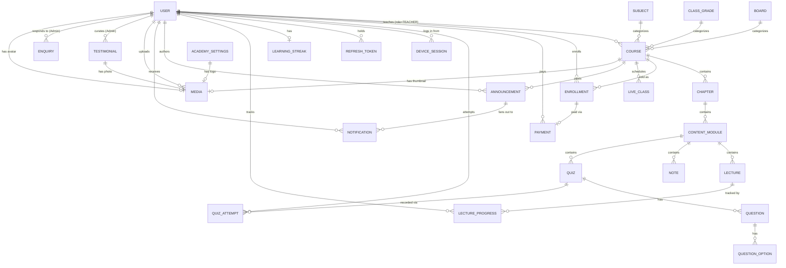

# Database Design
## OASIS V1 — Module 1 Deliverable (v1.1 — post-refinement)

The full, authoritative schema lives in [`database/schema.prisma`](../database/schema.prisma).
This document explains the *why* behind it. This revision reflects the
Module 1 refinements you requested after the initial review.

---

## 1. Entity-Relationship Diagram



---

## 2. Key Design Decisions

### 2.1 Course hierarchy: Board → Class → Subject → Chapter → Module

Per your request, **Board is now a first-class table**, not an enum. The
previous `BoardType { CBSE, ICSE, STATE }` enum couldn't represent that
"State Board" isn't one thing — different states run different boards
(Karnataka State Board, Maharashtra State Board, etc.). Promoting it to a
`Board` table means adding a new state board later is a data insert, exactly
like adding a new `Subject` already was — no schema change, no deployment.

**A note on where "Course" fits:** the hierarchy you specified is
Board → Class → Subject → Chapter → Module. In the schema, `Course` is the
entity that sits at the Board+Class+Subject intersection — it's the
sellable/enrollable unit (it carries the price, the teacher, and the
enrollment/payment relationships), and Chapters/Modules nest beneath it. So
concretely: `Course.boardId` + `Course.classGradeId` + `Course.subjectId`
together locate a course in the hierarchy, and `Chapter`/`ContentModule`
continue nesting under `Course` exactly as before. This preserves your
hierarchy for browsing and URLs (see §2.2) while keeping a single entity to
attach price/teacher/payment to — introducing a separate "Board-Class-Subject
offering" entity distinct from Course would have been redundant, since in
practice each is the same thing.

**Trade-off considered:** should `ClassGrade` and `Subject` themselves be
scoped *under* a specific `Board` (e.g., "CBSE's Class 8" as a different row
than "ICSE's Class 8")? Rejected for V1 — the brief's own subject list
(Mathematics, Science, English) and class list (4–10) are the same concepts
regardless of board. Keeping them global/shared avoids duplicate rows for
every board and keeps the admin UI for adding a subject a one-step action.
If a specific board ever needs a genuinely different subject (e.g., a
state-mandated regional language course), that's still just a new `Subject`
row, filtered per board at the `Course` level — no restructuring needed.

### 2.2 SEO-friendly slugs (Course, Chapter) and the URL scheme this enables

`Course.slug` (already unique globally) plus the new `Chapter.slug` (unique
*within its parent course*, via `@@unique([courseId, slug])`) support a clean,
crawlable URL structure, e.g.:

```
/courses/cbse-class-8-mathematics-foundation                  (Course detail — Course.slug)
/courses/cbse-class-8-mathematics-foundation/algebra-basics   (Chapter deep link — Chapter.slug)
```

`Board.slug`, `ClassGrade.slug`, and `Subject.slug` were also added (they
didn't all exist before) so the course *browse/filter* pages can use
readable paths too, e.g. `/courses?board=cbse&class=8&subject=mathematics`
or a nested browse route like `/cbse/class-8/mathematics`. Chapter slugs are
scoped per-course rather than global because chapter titles like "Introduction"
or "Revision" legitimately repeat across many courses — a global unique
constraint would have forced awkward disambiguation (`introduction-2`,
`introduction-3`) for no benefit.

### 2.3 Course Status vs. Lecture Status — two separate enums, on purpose

Previously there was one generic `ContentStatus` shared loosely across
content types. That's now split into two distinct, purpose-built enums:

- **`CourseStatus`** (`DRAFT | PUBLISHED | ARCHIVED`) — governs whether a
  course is visible/purchasable at all.
- **`LectureStatus`** (`DRAFT | PUBLISHED | HIDDEN`) — governs whether an
  *individual lecture within an already-published course* is visible.

This split matters in practice: a teacher can publish a course and then add
a new lecture that stays `DRAFT` while they finish editing it, or `HIDDEN`
temporarily (e.g., pulling a lecture to fix an error) without touching the
course's own `PUBLISHED` status or affecting other students already
enrolled and watching other lectures. `ARCHIVED` doesn't apply to a single
lecture the same way it applies to a whole course, hence `HIDDEN` instead —
a lecture is either visible, not-yet-visible, or deliberately pulled; it
isn't "archived" independent of its course.

Chapters, Modules, Notes, and Quizzes deliberately do **not** get their own
status enum in V1 — they inherit visibility from their parent Course's
status, and individual removal is handled by soft delete (§2.6), not a
separate publish workflow. Adding per-item publish states for every content
level would be over-engineering for what the brief asks for; if teacher
feedback later shows a real need (e.g., "hide just one quiz"), it's an
additive enum + column, not a redesign.

### 2.4 One `User` table, not separate `Student`/`Teacher`/`Admin` tables

(Unchanged from the original design — rationale retained below.)

A single `User` model with a `role` enum was chosen over per-role tables,
since all four roles share the exact same auth mechanism (JWT, email +
password) and role-specific data is currently minimal. If a role's data
grows significantly, it belongs in a satellite table keyed 1:1 to `User` —
not a schema rewrite.

### 2.5 Media strategy: images live in a separate model, and a separate bucket, from video/notes

You asked for a media strategy covering teacher photos, course thumbnails,
academy logo, and testimonial photos — in addition to the existing video/PDF
handling. The key design decision: **images and videos are architecturally
different**, and the schema reflects that rather than pretending they're the
same kind of asset:

| | Videos & Notes (existing) | Images (new: `Media`) |
|---|---|---|
| Confidentiality | Private — must not be viewable without enrollment | Public — a course thumbnail or teacher photo has no access restriction |
| Storage | Private R2 bucket, `r2ObjectKey` only | Separate **public/CDN-fronted** R2 bucket (or Cloudflare Images), `r2ObjectKey` + a ready-to-use `publicUrl` |
| Access pattern | Short-lived signed URL, issued per request | Direct, long-lived public/CDN URL — must be embeddable in `` tags, Open Graph tags, and the sitemap without any auth |
| Model | `Lecture.r2ObjectKey`, `Note.r2ObjectKey` (unchanged) | New `Media` model, referenced by FK from `Course`, `User`, `Testimonial`, `AcademySettings` |

A single `Media` model (rather than a `courseThumbnailUrl` string column
scattered across four different tables) means: one upload pipeline, one
place to enforce image constraints (size, dimensions, allowed types), and
one place to track *who* uploaded an image and *when* — useful the moment
you need to moderate content or investigate a copyright complaint. Each
consuming table (`Course.thumbnailId`, `User.avatarId`, `Testimonial.photoId`,
`AcademySettings.logoId`) just holds a nullable foreign key to `Media`.

**Why not reuse the video pipeline for images?** Signed URLs expire (by
design, for videos) — but an `` on a public course page, an
Open Graph preview image shared on WhatsApp, and a sitemap image entry all
need a URL that still works minutes, hours, or days later. Forcing images
through the same short-TTL signed-URL pattern as videos would break SEO and
social sharing for no security benefit, since there's nothing to protect.

### 2.6 Soft deletes: the actual policy, not "everywhere"

You asked for soft deletes "wherever appropriate" — here's the concrete rule
applied consistently across the schema, so it's predictable rather than ad
hoc:

**Gets `deletedAt` (soft delete):** `User`, `Board`, `ClassGrade`, `Subject`,
`Course`, `Chapter`, `ContentModule`, `Lecture`, `Note`, `Quiz`,
`Announcement`, `LiveClass`, `Testimonial`, `Media`. These all represent
either an account or a piece of content that a human (Admin/Teacher/Student)
might remove and later regret removing, or that other rows still need to
reference for historical integrity (e.g., a `Course` a student already paid
for shouldn't vanish and break their `Enrollment`/`Payment` history just
because a teacher deleted it — it gets soft-deleted and hidden from browse
listings instead).

**Does NOT get `deletedAt`, and is never deleted at all:** `Payment`,
`Enrollment`, `QuizAttempt`, `LectureProgress`. These are financial or
academic-history records. They're immutable by design — deleting (even
softly) a payment record would be a bookkeeping problem, and deleting a
quiz-attempt score would falsify a student's history. `DeviceSession` and
`RefreshToken` also skip it — they're ephemeral session state with their
own expiry/revocation fields (`revokedAt`, `expiresAt`), which is the correct
tool for "this session is no longer valid," not a soft-delete flag.

**Does NOT get `deletedAt`, for a different reason:** `Question` and
`QuestionOption` are pure structural children of `Quiz` — nobody "deletes a
question" independent of editing its parent quiz, so they cascade-delete
with the quiz (`onDelete: Cascade`) rather than needing their own recovery
mechanism. `Enquiry` also skips it — a Contact-Us submission isn't really
"deleted," it moves through a status lifecycle (`NEW → IN_PROGRESS →
RESOLVED`, or `SPAM`), which is the more honest model for a support inbox.

**Application-layer convention (for Module 2):** the repository layer will
apply a `WHERE deletedAt IS NULL` filter by default on every read, with an
explicit `includeDeleted()` escape hatch reserved for Admin "recover this"
tooling. This keeps the soft-delete behavior centralized in one place
instead of every service remembering to filter it manually.

### 2.7 Notifications: generic now, so announcements aren't a special case later

`Notification` is a generic fan-out table: `userId`, `type`
(`ANNOUNCEMENT | PAYMENT | LIVE_CLASS_REMINDER | SYSTEM`), `title`, `body`,
`isRead`, and an optional `announcementId` back-reference. When a teacher
posts an `Announcement`, the service layer creates one `Notification` row
per enrolled student pointing at it. Payment confirmations, live-class
reminders, or any future system message reuse the exact same table with a
different `type` and no `announcementId` — no new table needed when the next
notification type shows up.

### 2.8 Enquiry (Contact Us) and Testimonial (Admin-managed)

- **`Enquiry`** captures public Contact-Us submissions (name, email, phone,
  subject, message) with a status workflow for Admin triage
  (`NEW → IN_PROGRESS → RESOLVED`, or `SPAM`) and an optional
  `respondedById`/`respondedAt` so there's a record of which Admin handled
  it. V1 doesn't build a full ticketing/reply-in-app system — Admins are
  expected to respond via their own email — this table exists to make sure
  submissions are captured and triaged, not lost.
- **`Testimonial`** is fully Admin-authored/curated content: author name,
  optional role/context, an optional photo (`Media`), the quote text, an
  optional star rating, an `isFeatured` flag for homepage highlighting, and
  `displayOrder` for manual curation. `isPublished` gates whether it's shown
  publicly, independent of `deletedAt` — an Admin can unpublish a testimonial
  temporarily without it counting as "deleted."

### 2.9 AcademySettings: a singleton, and deliberately *not* where secrets live

`AcademySettings` holds academy-wide branding/contact info (name, tagline,
logo, contact email/phone, address, social links, default SEO title/description)
that the frontend needs to render dynamically (footer, contact page, default
`<meta>` tags) without a code deploy every time the phone number changes.

**Two decisions worth calling out:**
1. **Singleton, not key-value.** A single-row table with explicit typed
   columns was chosen over a generic `Setting { key, value }` table. The
   fields you named (academy name, logo, contact details, social links) are
   known and stable, so typed columns give better validation and DX. The
   trade-off: adding a genuinely new setting later needs a migration, unlike
   a key-value store. If OASIS later needs a long tail of ad hoc feature
   flags or per-tenant config, a supplementary key-value table can be added
   *alongside* this one — it's additive, not a replacement.
2. **No secrets here — ever.** This table is readable through a public,
   unauthenticated `GET /api/v1/settings` endpoint so the frontend can render
   the footer/contact info without requiring login. That makes it the wrong
   place for anything sensitive by construction. Razorpay keys, JWT secrets,
   and R2 credentials stay exactly where they already were: environment
   variables, never in the database.

---

## 3. What's deliberately *still* not in the schema

- No `Parent`/`ParentStudentLink` tables (Parent Dashboard remains out of
  V1 scope — see `docs/02-architecture.md §9` for the extension point).
- No dedicated `Refund` ledger — `PaymentStatus.REFUNDED` marks the payment;
  a full refund ledger is deferred until refund volume justifies it.
- No per-lecture or per-quiz status beyond what's described in §2.3.

---

## 4. Migrations

Still unchanged from Module 1's original plan: no migration has been
generated yet. That happens in Module 2, once this schema is frozen and a
real Postgres instance is available to migrate against.
`database/seed.ts` will seed: the 3 initial `Board` rows (CBSE, ICSE, State
Board — with the explicit understanding that specific state boards can be
added as additional rows later), the 7 `ClassGrade` rows (Class 4–10), the 3
initial `Subject` rows (Mathematics, Science, English), and a single
`AcademySettings` row with placeholder values for you to fill in via the
Admin dashboard once it exists.
